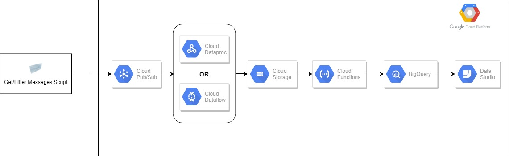
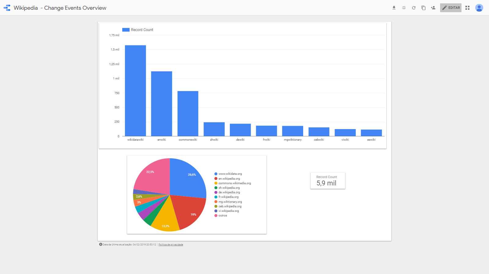

# Rouse Test

## Task1 - Documentation

    The pipeline was design on GCP, because its ecosystem makes easier to manipulate data. From ingestion to Visualization there are options to get a data project done. This pipeline also was built seeking been efficient with time and cost. Once it been said, follow below the pipeline diagram:

    


## Task2 - Extract

    For this task I have used a Python script to consume from Wikipedia API(SSE) and to send this data to Pub/Sub. Once the events are in Pub/Sub I have chose the simplest solution - a predefined Dataflow job, once the scope of the problem doesn’t mention any necessary transformation. This ready-to-use Dataflow pipeline, reads from an topic on Pub/Sub and writes files in a 5 minutes window. Also it is possible to consume from Pub/Sub and writing to Storage with Dataproc. 
    I could use Dataflow and Dataproc also to streaming data directly to Big Query, but BQ has an extra fee about streaming data in its tables. Once there is not an short SLA,I have found this extra cost not worthy at this moment. 

## Task3 - Storage

    I have used Big Query as my storage database and to insert data that comes from Storage, I chose Cloud Function. Once the file gets on Storage it sends a request to Big Query to load this file. In order to achieve one of the requirements of this task, that is about to keep the size down, I have proposed to have daily tables that expires after a configurable number of days.

## Task4 - Visualization

    In order to accomplish this task I have used Data Studio. I have built a simple dashoboad with some metrics about the Wikipedia Changes.
    Follow below a print of it:

 

## Task5 - Query

    Here are some queries that can be used to explore the data stored on Big Query:
        - bq --location=US query --use_legacy_sql=false 'SELECT wiki, count(*) as qty_changes FROM `micro-avenue-230617.wikipedia_event.change_events*` GROUP BY wiki ORDER BY qty_changes DESC'

        - bq --location=US query --use_legacy_sql=false 'SELECT meta.domain, count(*) as qty_changes FROM `micro-avenue-230617.wikipedia_event.change_events*` GROUP BY meta.domain ORDER BY qty_changes DESC'
        


## Setup


1. Open CLoud Shell
2. run "git clone https://github.com/vinidemoura/event_stream_ingestion_wikipedia.git" to clone the git repository
3. run "source event_stream_ingestion_wikipedia/setup/local.env" to export environment variables.
4. run "sudo pip3 install -r event_stream_ingestion_wikipedia/stream/requirements.txt" to install libraries requerired for producer that will send data to Pub/Sub. 
5. run "cd event_stream_ingestion_wikipedia && python3 stream/gcp_stream.py" to run the producer that will send data to Pub/Sub

Run Dataflow Job

1. On CLoud Console, click on DataFLow icon
2. Click on "CREATE JOB FROM TEMPLATE" button
3. Fill the fields with the follow values:
    - Job name: "wiki-event-dataflow"
    - Cloud Dataflow template: Cloud Pub/Sub to Cloud Storage text
    - Input Cloud Pub/Sub topic : "projects/micro-avenue-230617/topics/event_stream_wikipedia"
    - Output Cloud Storage directory: "gs://wikipedia_events/"
    - Output file prefix: "output-"
    - Temporary Location: "gs://wikipedia_events/tmp"
    - Output file suffix: "json"
    - Max workers: 1

Deploy function on Google Cloud Shell

1. on cloud shell, open a new tab
2. run "cd event_stream_ingestion_wikipedia/function && zip setup main.py requirements.txt"
3. run "gsutil cp setup.zip gs://cloud-function-setup/"
4. Run this command:
```
    gcloud functions deploy strorage_to_bq \
    --region us-east1 \
    --runtime python37 \
    --entry-point gcs2bigquery \
    --trigger-resource wikipedia_events \
    --trigger-event google.storage.object.finalize \
    --source gs://cloud-function-setup/setup.zip \
    --set-env-vars PROJECT_ID=micro-avenue-230617,DATASET_ID=wikipedia_event,TABLE_ID=change_events
```

## API References
- https://googleapis.github.io/google-cloud-python/latest/bigquery/index.html
- https://cloud.google.com/functions/docs/how-to
- https://github.com/GoogleCloudPlatform/python-docs-samples/blob/master/functions/gcs
- https://cloud.google.com/sdk/gcloud/reference/beta/functions/deploy

- https://cloud.google.com/dataflow/docs/templates/executing-templates#modelos-fornecidos-pelo-google


